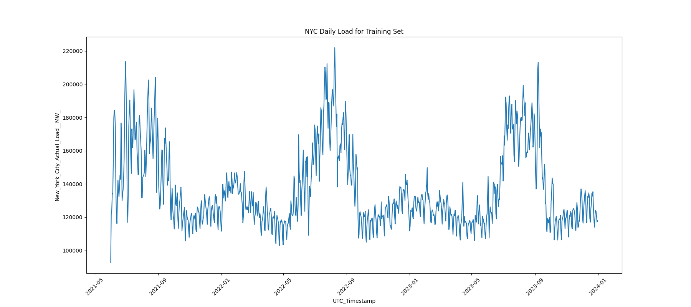
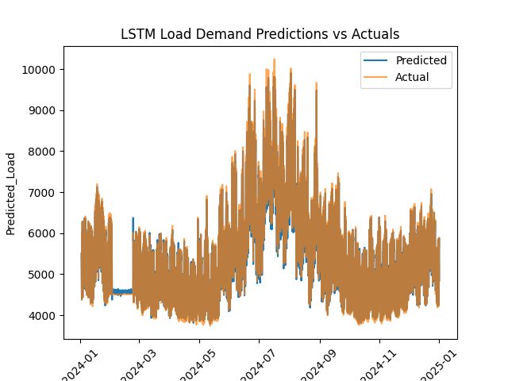

# Forecasting NYC Electricity Load using Deep Learning

## Instructions

For ease of version control, the Python notebooks have been saved as Python scripts. HTML views of the notebooks are available [here](html/html_preview.md). Alternatively, the CLI commands [here](cli-reference.md) can convert the Python scripts back to noteboks.

## Overview

This is an ongoing personal project conducted by [Ayush Shrestha](https://www.linkedin.com/in/ayush-yoshi-shrestha/). This project analyzes hourly electricity demand and temperature data for the city of New York from June 2021 to September 2024 using a recurrent neural network (RNN) in PyTorch. The dataset, obtained from the U.S. Energy Information Administration (EIA), can be accessed [here](https://www.eia.gov/electricity/wholesalemarkets/data.php?rto=nyiso)

## Business Objective

For a city as complex as New York, accurately predicting hourly electricity demand is crucial for ensuring smoother, more sustainable, and cost-efficient energy management. The task, however, presents significant challenges due to factors such as seasonality, time dependencies, and external variables like temperature and holidays, which can have a substantial impact on demand.

Effective demand forecasting enables grid operators to prevent overloads, reduce the risk of blackouts, and maintain a balanced power supply, particularly during peak hours or extreme weather events. This allows utility companies to optimize electricity generation, distribution, and storage, ensuring that sufficient power is available to meet demand. Furthermore, precise demand predictions support city planners in shaping future infrastructure, guiding energy policies, and driving sustainability initiatives.

## Dataset Overview

The original dataset comprises over 27,000 hourly observations, covering the period from June 1, 2021, to September 20, 2024. Each year’s data is provided in a separate CSV file, containing hourly timestamps (in the UTC time zone), electricity demand measurements in megawatts (MW) for seven regions within New York State, and temperature measurements in Fahrenheit recorded at Buffalo Niagara and JFK Airport. For the purposes of this analysis, only the demand data specific to New York City area was used.

## Data Processing

**Missing Timestamps**:
I started by importing and merging all the CSV files to create a single comprehensive dataset. Although the dataset initially appeared to be complete with no missing values, further inspection revealed several missing timestamps, ranging from individual hours to multiple days. To address this, a separate list of the full range of dates was generated and used to re-index with the original dataset. This ensured that the entire date range was included, which naturally introduced missing values for the timestamps that were absent in the original data. 

At this stage, the data was split into the training and test sets, using data from 2021 to 2023 for training and data from 2024 as test. This split was conducted early in the process to prevent any cross-contamination between the training and test data during subsequent data cleaning and transformations.

**Load Imputation**:
In the training set, missing values were initially filled using the average demand from the same period in previous years. This approach was chosen due to the data spanning only three years, with no obvious trend. For cases where no prior periods were available for reference, such as missing data in 2021, linear time-based interpolation was applied. In contrast for the test set, to prevent data leakage, a simpler forward-fill method was used to impute missing values. 

## Exploratory Data Analysis (EDA)

To better understand the data, I created boxplots across various time scales (hourly, monthly, quarterly, and yearly) to examine the distribution and variability of electricity demand and temperature. From this we see that peak load occurs around 2100-2200 UTC i.e., 5-6 p.m. EST, and that there are some outliers in the data.

Additionally, I generated histograms to visualize the statistical spread and distribution of the load values. From this plot we also see that the load demand is right-skewed, verifying the presence of outliers.

I then plotted a line chart of electricity demand over time, allowing me to identify general temporal patterns and trends in the data. This provided insights into the seasonality and typical range of the data.

## Model Configuration

**Data Normalization**:
The training and test sets were normalized by scaling the feature values between 0 and 1. This normalization was crucial to help the RNN model converge more effectively during training by standardizing the input range.

**Model Selection**:
To effectively capture long-term dependencies and sequential patterns in the time-series data, a Long Short-Term Memory (LSTM) model was selected for forecasting future electricity demand.

Following object-oriented design principles, I defined classes to manage both the dataset and the model architecture. The LSTM architecture consists of the following components:

- Two LSTM layers with 50 neurons each, designed to capture the temporal dynamics of the data.
- Dropout layers, with a 20% probability, after each LSTM layer to prevent overfitting. While additional layers and neurons can capture more complex relationships, they also increase the risk of overfitting, which the dropout layers mitigate by performing regularization.
- A Linear layer that condenses the output from the LSTM layers down to a single value, enabling the model to produce a continuous regression output for electricity demand predictions.

## Model Training and Evaluation

Using PyTorch's DataLoader, I implemented a training loop with the following key hyperparameters:

- A sliding window size of 24 hours, where each set of 24 hours is used to predict the 25th hour.
- A batch size of 32.
- 30 training epochs.
- The Adam optimizer with a learning rate of 0.0001 to adjust the model's weights during backpropagation.
- Mean Squared Error (MSE) as the loss function, suitable for this regression task.

After 30 epochs, the training converged with an MSE of approximately 0.0001 on the normalized data. For the test set, the inference loop achieved an average MSE of 0.0003, again based on the normalized data.

I then recorded the predicted and actual values into a dataframe and un-normalized the data back to its original units. This allowed for the calculation of the model's Root Mean Squared Error (RMSE), which was 124 MW. This is compared to an interquartile range of demand between 4900 and 6600 MW, highlighting the accuracy of the model relative to typical demand levels.

**Note**:
An initial baseline model was trained using only historical electricity demand data. This model achieved an RMSE of approximately 131 MW on the test set. In contrast, the subsequent model (desribed thus far, incorporating both historical demand and temperature data) resulted in an over 5% reduction in RMSE on the test set. This improvement demonstrates that while the model learned the most from historical demand patterns, the inclusion of temperature data provided a non-trivial enhancement to the prediction accuracy.

## Findings

The plot below illustrates the predicted electricity demand against the actual load:

The model predicts the highest demand of 7271 MW in July, with a peak hourly demand of 6393 MW occurring at 6 p.m. EST. These predictions indicate that NYC utilities should prioritize reinforcing the grid to handle increased demand, particularly during summer evenings when electricity usage tends to spike. Additionally, allocating extra resources during peak periods could help prevent blackouts or system overloads. Utilities may also consider implementing demand-side management strategies, such as incentivizing consumers to reduce electricity usage during peak hours, especially in the evenings, to maintain grid stability.

## Next Steps

I plan to evaluate the robustness of the results by comparing the LSTM model's performance with traditional forecasting methods like ARIMA, to determine if the deep learning approach offers a clear advantage over more conventional models.
