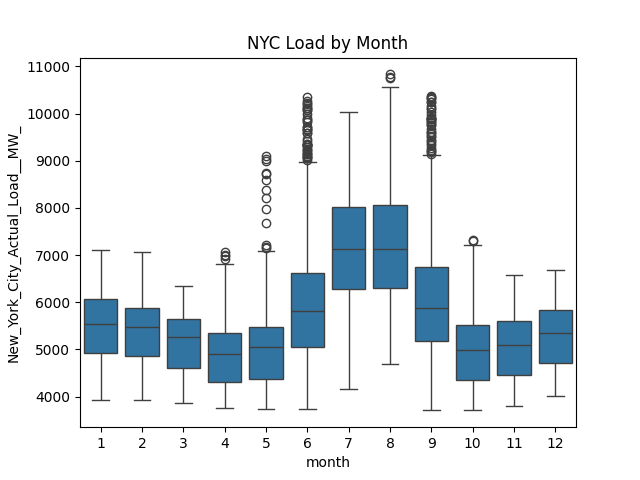

# Forecasting NYC Electricity Load using Deep Learning

## Overview

This is an ongoing personal project conducted by [Ayush Shrestha](https://www.linkedin.com/in/ayush-yoshi-shrestha/). This project analyzes hourly electricity demand data for the city of New York from June 2021 to Sept 2024 using a recurrent neural network (RNN).The dataset, obtained from the U.S. Energy Information Administration (EIA), can be accessed [here](https://www.eia.gov/electricity/wholesalemarkets/data.php?rto=nyiso)

## Business Objective

For a city as complex as New York, accurately predicting hourly electricity demand is crucial for ensuring smoother, more sustainable, and cost-efficient energy management. The task, however, presents significant challenges due to factors such as seasonality, time dependencies, and external variables like temperature and holidays, which can have a substantial impact on demand.

Effective demand forecasting enables grid operators to prevent overloads, reduce the risk of blackouts, and maintain a balanced power supply, particularly during peak hours or extreme weather events. This allows utility companies to optimize electricity generation, distribution, and storage, ensuring that sufficient power is available to meet demand. Furthermore, precise demand predictions support city planners in shaping future infrastructure, guiding energy policies, and driving sustainability initiatives.

## Dataset Overview

The original dataset comprises over 27,000 hourly electricity demand observations, covering the period from June 1, 2021, to September 20, 2024. Each year’s data is provided in a separate CSV file, containing hourly timestamps (in the UTC time zone) and electricity demand measurements in megawatts (MW) for seven regions within New York State. For the purposes of this analysis, only the demand data specific to New York City was used.

## Data Processing

**Missing Timestamps**:
I started by importing and merging all the CSV files to create a single comprehensive dataset. At this stage, the data was split into the training and test sets, using data from 2021 to 2023 for training and data from 2024 as test. This split was conducted early in the process to prevent any cross-contamination between the training and test data during subsequent data cleaning and transformations.

Although the dataset initially appeared to be complete with no missing values, further inspection revealed several missing timestamps, ranging from individual hours to multiple days. To address this, a separate list containing the full range of dates was generated and left-joined with the original dataset. This ensured that the entire date range was included, which naturally introduced missing values for the timestamps that were absent in the original data.

**Load Imputation**:
In the training set, an initial imputation was carried out to address the missing load values. Missing values were filled using the average demand from the same period in previous years. For cases where no prior periods were available for reference, such as missing data from 2021, time-based interpolation was applied. In contrast for the test set, a simpler forward-fill method was used to impute missing values, for a simple and consistent solution.

## Exploratory Data Analysis (EDA)

To better understand the data, I created boxplots across various time scales (hourly, monthly, quarterly, and yearly) to examine the distribution and variability of electricity demand. From this we see that peak load occurs around 2100-2200 UTC i.e., 5-6 p.m. EST, and that there are some outliers in the data. 

Additionally, I generated histograms to visualize the statistical spread and distribution of the load values. From this plot we also see that the load demand is right-skewed, verifying the presence of outliers.

I then plotted a line chart of electricity demand over time, allowing me to identify general temporal patterns and trends in the data. This provided insights into the seasonality and typical range of the data.

## Model Configuration

**Data Normalization**: 
The training and test sets were normalized by scaling the electricity demand values between 0 and 1. This normalization was crucial to help that the RNN model converge more effectively during training by standardizing the input range.

**Model Selection**:
I chose LSTM model for future electricity demand forecasting due to its ability to capture long-term dependencies and sequential behavior in time series data.
The architecture consisted of two LSTM layers with 50 units (neurons) each. While increasing the number of layers and units can capture complex temporal dependencies, it also increases the risk of overfitting. To address this, I applied regularization techniques, including Dense and Dropout layers. To capture the nonlinearity and learn the complex pattern of the data, I used ReLU activation function. By outputting 0 to negative values, ReLU prevents vanishing gradient problem. 

## Model Training and Evaluation
The LSTM model was implemented using PyTorch. Data from June 1, 2021 to December 31, 2023 was used as training set, while the remaining data was set aside for testing. The sliding window size (number of past observations) is 24 hours. Key hyperparameters:
LSTM units = 50 (neurons)
Batch size= 32
Number of epochs = 20
Learning rate = 0.001
Dropouts = 0.2 (to take care of overfitting)
Since the task involves time series data, Mean Squared Error loss function was used. Adam optimizer was employed to adjust the weight and tune the learning rate during back-propagation and aid better convergence.

## Results and Interpretation 
The model achieved RMSE of 142 MW on the test set (with actual interquartile demand ranging from 4900 to 6600 MW). The predicted highest demand of 7225 MW occurred in July, and the peak hourly demand of 6384 at 6 p.m. EST. These predictions from LSTM model suggest that NYC utilities should ensure that the grid is reinforced to handle higher demands during summer evenings. Furthermore, allocating additional resources during peak-demand periods could prevent blackouts or system overloads. Utilities may also incentivize consumers to reduce usage during peak hours, especially in the evenings. Below we see the plot of the predicted load against the actual load.

## Next Steps:
The next phase of this project involves integrating weather data to further improve accuracy. I also plan to check the robustness of the results with GRU model and more traditional forecasting models like ARIMA.

